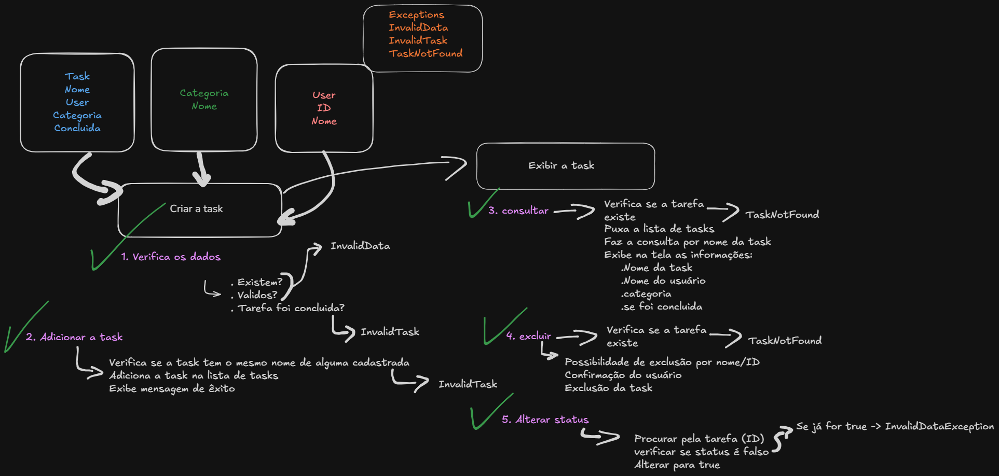

# TaskManager 📝

---

# 🇧🇷 Português

## Sobre o Projeto
O **TaskManager** é um sistema robusto de gerenciamento de tarefas desenvolvido em Java para rodar no console. Este projeto marca a finalização do módulo básico do **IRede**, demonstrando a aplicação prática de conceitos fundamentais de programação orientada a objetos (POO), arquitetura em camadas e boas práticas de design de software.

O objetivo foi criar uma aplicação interativa onde usuários podem ser cadastrados e gerenciar suas tarefas diárias com facilidade, garantindo a integridade dos dados através de validações e tratamento de exceções.

### 🚀 Funcionalidades Principais
*   **Gestão de Usuários:** Cadastro simples de usuários com IDs únicos.
*   **Ciclo de Vida da Tarefa:**
    *   **Criar:** Adicione tarefas vinculadas a um usuário e categoria.
    *   **Consultar:** Visualize detalhes completos ou liste todas as tarefas.
    *   **Concluir:** Marque tarefas como finalizadas.
    *   **Excluir:** Remova tarefas que não são mais necessárias.
*   **Menu Interativo:** Interface de console amigável e à prova de falhas (tratamento de entradas inválidas).

### 🧠 Arquitetura e Design
O projeto foi estruturado seguindo o padrão de **Camadas (Layered Architecture)** para garantir organização e manutenibilidade:
*   **Model:** Representação dos dados (Task, User, Category).
*   **Service:** Lógica de negócios e regras do sistema (TaskService, UserService).
*   **UI:** Interface com o usuário (ConsoleMenu).
*   **Exception:** Tratamento personalizado de erros.

## Esboço do Projeto 🗺️
Antes de escrever qualquer código, o fluxo e a arquitetura foram desenhados para garantir uma implementação fluida. Este diagrama guiou o desenvolvimento das relações entre objetos e validações.

---

# 🇺🇸 English

## About the Project
**TaskManager** is a robust task management system developed in Java to run on the console. This project marks the completion of the **IRede** basic module, demonstrating the practical application of fundamental Object-Oriented Programming (OOP) concepts, layered architecture, and software design best practices.

The goal was to create an interactive application where users can be registered to manage their daily tasks easily, ensuring data integrity through validation and exception handling.

### 🚀 Key Features
*   **User Management:** Simple registration of users with unique IDs.
*   **Task Lifecycle:**
    *   **Create:** Add tasks linked to a user and category.
    *   **Consult:** View full details or list all tasks.
    *   **Complete:** Mark tasks as finished.
    *   **Delete:** Remove tasks that are no longer needed.
*   **Interactive Menu:** User-friendly console interface designed to be fail-safe (handling invalid inputs).

### 🧠 Architecture & Design
The project follows a **Layered Architecture** pattern to ensure organization and maintainability:
*   **Model:** Data representation (Task, User, Category).
*   **Service:** Business logic and system rules (TaskService, UserService).
*   **UI:** User Interface (ConsoleMenu).
*   **Exception:** Custom error handling.

## Project Sketch 🗺️
Before writing any code, the flow and architecture were sketched to ensure smooth implementation. This diagram guided the development of object relationships and validations.

