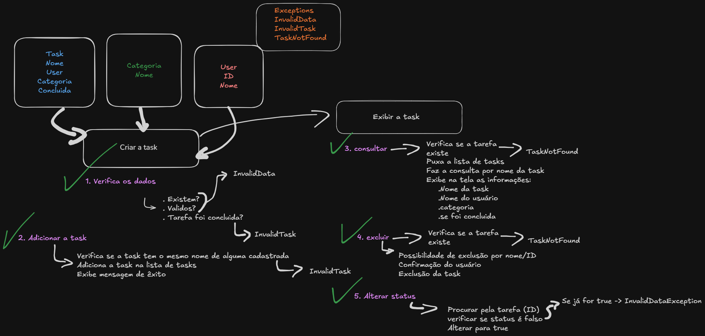

# TaskManager


Aplicação desktop para gerenciamento de tarefas, usuários e categorias, desenvolvida em Java com JavaFX, FXML e SQLite.

## Como executar

### Via Maven
```bash
mvn javafx:run
```

### Via IDE
1. Reimporte o projeto como Maven.
2. Marque `src/main/java` como source root, se necessário.
3. Execute `org.example.Main`.

## Funcionalidades

- Criar, editar, listar e excluir tarefas.
- Criar, editar, listar e excluir usuários.
- Criar, editar, listar e excluir categorias.
- Interface gráfica com JavaFX e Scene Builder.

## Estrutura da aplicação

- `model` - entidades da aplicação.
- `dao` - acesso ao SQLite.
- `service` - regras de negócio.
- `ui` - controllers JavaFX.
- `app` - ponto de entrada da interface.

## Arquitetura


## Fluxo principal


## Visão geral da aplicação



## Observações

- A aplicação usa SQLite local para persistência.
- O layout foi criado com JavaFX + Scene Builder.
- Para abrir a interface, a classe principal recomendada é `org.example.Main`.
